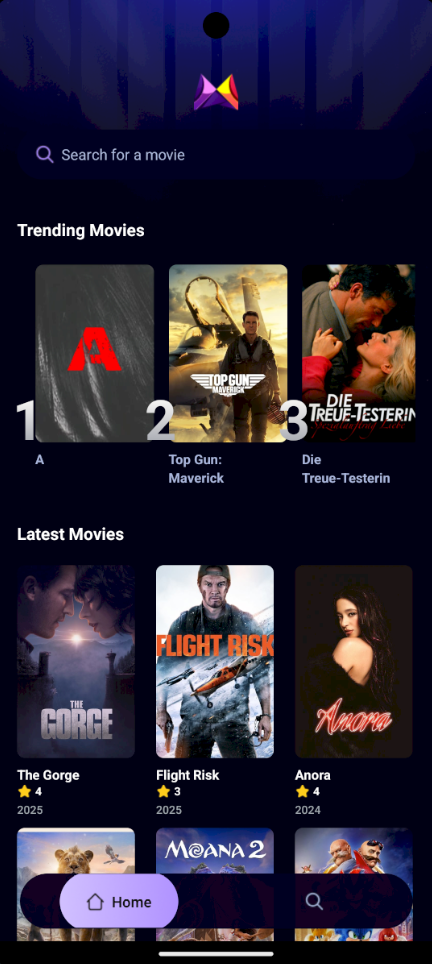
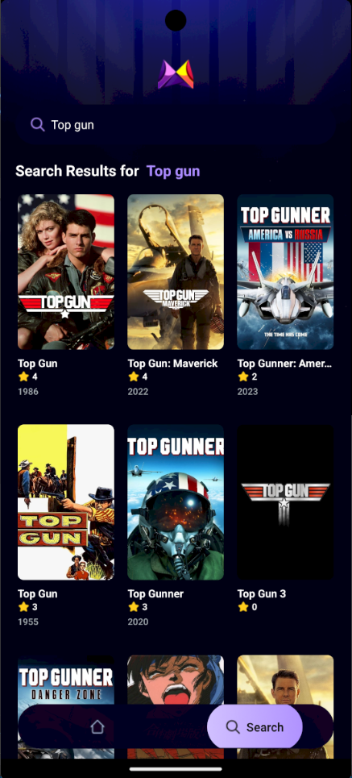

# Movie Catalog App

O Movie Catalog App é um aplicativo móvel que permite aos usuários pesquisar e visualizar informações sobre filmes. Ele utiliza a biblioteca React Native e o framework Expo para desenvolvimento multiplataforma.

## Índice

- [Instalação](#instalação)
- [Uso](#uso)
- [Scripts Disponíveis](#scripts-disponíveis)
- [Tecnologias Utilizadas](#tecnologias-utilizadas)
- [Créditos](#créditos)

## Instalação

Para instalar as dependências do projeto, execute:

   ```bash
   npm install
   ```

## Uso

1. Inicie o aplicativo:

   ```bash
   npx expo start
   ```

2. No output, você encontrará opções para abrir o aplicativo em:

   - [Build de desenvolvimento](https://docs.expo.dev/develop/development-builds/introduction/)
   - [Emulador Android](https://docs.expo.dev/workflow/android-studio-emulator/)
   - [Simulador iOS](https://docs.expo.dev/workflow/ios-simulator/)
   - [Expo Go](https://expo.dev/go), um sandbox limitado para experimentar o desenvolvimento de aplicativos com Expo

## Scripts Disponíveis

- `npx expo start`: Inicia o servidor de desenvolvimento.
- `npx expo start android`: Inicia o aplicativo no emulador Android.
- `npx expo start ios`: Inicia o aplicativo no simulador iOS.
- `npx expo start web`: Inicia o aplicativo no navegador.

## Tecnologias Utilizadas

- React Native: Biblioteca para construir interfaces de usuário nativas para iOS e Android usando React.
- Expo: Framework e plataforma para aplicativos React Native que facilita o desenvolvimento, a construção e a implantação de aplicativos.
- TypeScript: Superset do JavaScript que adiciona tipos estáticos e outras funcionalidades avançadas.
- Tailwind CSS: Biblioteca de utilitários CSS para estilização rápida e eficiente.
- Hermes: Motor JavaScript otimizado para aplicativos React Native, que melhora o desempenho.
- React Navigation: Biblioteca para navegação em aplicativos React Native.
- Expo Router: Biblioteca para roteamento em aplicativos Expo.
- Appwrite: Plataforma de backend como serviço (BaaS) para autenticação, banco de dados, armazenamento e muito mais.
- MaskedView: Biblioteca para criar máscaras em componentes React Native.

## Créditos

Este projeto de estudo é baseado no projeto [react-native-movie-app](https://github.com/adrianhajdin/react-native-movie-app). Agradecimento especial ao [adrianhajdin](https://github.com/adrianhajdin) por fornecer a base para este aplicativo.

## Imagens do Aplicativo

<div id="slideshow">
  
  
  
  <a class="prev" onclick="plusSlides(-1)">&#10094;</a>
  <a class="next" onclick="plusSlides(1)">&#10095;</a>
</div>

<style>
  #slideshow {
    position: relative;
    width: 100%;
    max-width: 600px;
    margin: auto;
  }
  .slide {
    display: none;
    width: 100%;
  }
  .prev, .next {
    cursor: pointer;
    position: absolute;
    top: 50%;
    width: auto;
    padding: 16px;
    margin-top: -22px;
    color: white;
    font-weight: bold;
    font-size: 18px;
    transition: 0.6s ease;
    border-radius: 0 3px 3px 0;
    user-select: none;
  }
  .next {
    right: 0;
    border-radius: 3px 0 0 3px;
  }
  .prev:hover, .next:hover {
    background-color: rgba(0,0,0,0.8);
  }
</style>

<script>
  let slideIndex = 1;
  showSlides(slideIndex);

  function plusSlides(n) {
    showSlides(slideIndex += n);
  }

  function showSlides(n) {
    let i;
    let slides = document.getElementsByClassName("slide");
    if (n > slides.length) {slideIndex = 1}
    if (n < 1) {slideIndex = slides.length}
    for (i = 0; i < slides.length; i++) {
      slides[i].style.display = "none";
    }
    slides[slideIndex-1].style.display = "block";
  }
</script>